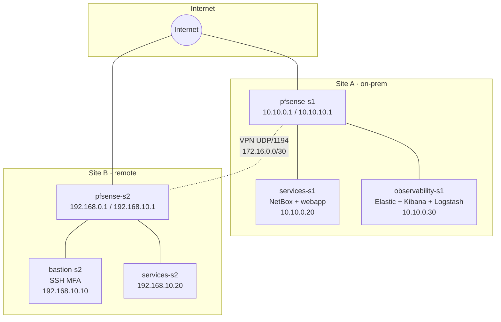
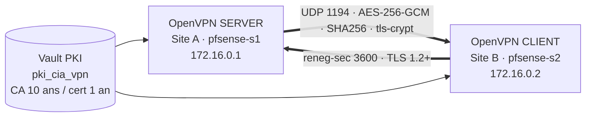
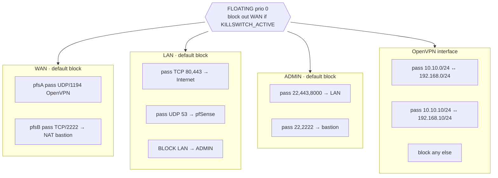

# Architecture — diagrammes

Trois diagrammes au format `.drawio` (ouvrables par <https://app.diagrams.net>)
avec, ci-dessous, un **fallback Mermaid** rendu directement par GitHub.

## 1. Infrastructure globale

Source : [`infra.drawio`](infra.drawio)

## 2. Tunnel VPN

Source : [`vpn.drawio`](vpn.drawio)

## 3. Règles firewall

Source : [`firewall-rules.drawio`](firewall-rules.drawio)

## 4. Export SVG/PNG

Chaque `.drawio` peut être exporté en SVG depuis draw.io :
`File → Export as → SVG / PNG → Selection only · no background`.
Les exports sont committés sous `docs/architecture/export/` (non montré
ici pour éviter de polluer le diff).
