# FW2 — Démo walkthrough avec preuves

**Projet** : T-NSA-810-REP25 — Deployment & Securing of a Hybrid Infrastructure with Proxmox
**Groupe** : GR46 — Epitech 2025-2026
**Auteur** : PAR_25
**Date** : 2026-04-29
**Tag** : `fw2-2026-04`

---

## Résumé du projet en français accessible

> Cette section s'adresse à un lecteur qui n'est pas spécialiste réseau
> ni DevOps. Elle explique en mots simples ce que le projet fait,
> pourquoi, et comment.

### En une phrase

Le projet **CIA** consiste à monter une infrastructure informatique
répartie sur **deux sites distants**, sécurisée de bout en bout, et
entièrement décrite par du code (pas de clic à la main). Imaginez **deux
"datacenters miniatures"** reliés par un tunnel chiffré, avec un
**bastion** (porte d'entrée unique sécurisée) et un **firewall** (videur
réseau) à l'entrée de chaque site.

### Les 8 ingrédients du projet

1. **Proxmox** — un hyperviseur, c'est-à-dire un logiciel qui héberge
   plusieurs machines virtuelles (VM) sur un seul serveur physique.
2. **VPN site-à-site** — un "tunnel chiffré" entre les 2 sites, pour
   que les VMs des deux sites se parlent comme si elles étaient sur le
   même réseau local, sans passer en clair sur Internet.
3. **pfSense** — un firewall logiciel (basé sur FreeBSD) qui filtre le
   trafic réseau entrant et sortant.
4. **Bastion** — une VM Linux durcie qui sert de **point d'entrée
   unique** pour les administrateurs. Tout passage par SSH externe
   transite par le bastion, qui logge tout et exige une authentification
   à deux facteurs (mot de passe + code à 6 chiffres généré par une
   app comme Google Authenticator).
5. **NetBox** — un logiciel d'inventaire réseau (IPAM = IP Address
   Management). Il sait quelles plages d'IPs sont allouées à quel site,
   quel service, quelle VM.
6. **Elastic Stack** — la chaîne de gestion des logs : Filebeat collecte
   les logs sur chaque VM, Logstash les transforme et les enrichit,
   Elasticsearch les stocke, Kibana permet de les visualiser dans des
   tableaux de bord.
7. **OpenVPN** — l'outil qui crée le tunnel chiffré du Site A vers le
   Site B (point 2).
8. **DNS forwarder (unbound)** — pour qu'une machine du Site A puisse
   appeler `webapp.s2.lan` et obtenir l'IP de la machine du Site B,
   sans configurer manuellement chaque résolution.

### Comment c'est piloté

- **Terraform** lit le code et **provisionne** les VMs et les réseaux
  sur Proxmox (création).
- **Ansible** lit le code et **configure** les services dans les VMs
  (installation, paramétrage).
- **SOPS + age** chiffre les secrets (mots de passe, clés API) dans le
  repo Git pour qu'ils ne soient jamais en clair.
- **GitHub Actions** vérifie automatiquement à chaque commit que le
  code est syntaxiquement valide, sans secret en clair, et passable
  aux outils de lint (vérificateurs de qualité).

### Ce qu'on prouve dans cette démo Follow-up 2

- Le **code** est complet, lintable, et passe les 4 workflows CI.
- L'**architecture** est documentée par 3 diagrammes + une matrice
  d'accès lisible.
- Une partie du **runtime** est déjà déployée (lab dev local, 3 VMs
  running).
- L'**infrastructure prod** (école) est allouée et prête pour la
  bascule en Follow-up 3.
- Les **runbooks** (modes opératoires) couvrent toutes les opérations
  critiques : VPN, killswitch, bastion, secrets, NetBox, Elasticsearch,
  pfSense, plus un DRP avec 5 scénarios.

Pour les acronymes et termes techniques utilisés ci-dessous, voir
**Annexe C — Glossaire** en fin de document.

---

## Conformité au cahier des charges Epitech (`project-2.pdf`)

Ce walkthrough vise la **conformité explicite** au cahier des charges
Epitech CIA. Mapping rapide :

### Livrables Follow-up 2 (PDF page 5)

| Livrable PDF | Section walkthrough | Capture |
|---|---|---|
| First infrastructure components in place | Section 2 + Section 5b | 05, 06, 07, 18, 19 |
| Updated Gantt / ticketing | Section 5d.1 + Section 5d.2 | 20, 22 |
| Reporting of technical blockers encountered | Section 5d.3 | 21 |
| List of tickets for next follow-up (FW3) | Section 5d.2 | 22 |

### Goals (PDF page 1)

| Goal | Couverture |
|---|---|
| Hybrid infra Proxmox Site 1 + Site 2 | Section 1.1 + Section 2 + Section 5b (cap 01, 05, 18, 19) |
| Site-to-site VPN | Section 1.2 (cap 02) + `runbooks/vpn.md` |
| Firewalls + emergency cut-off | Section 1.3 + Section 3.3 + Section 5.2 (cap 03, 10, 16) |
| Bastion host | Section 3.2 + Section 1.4 (cap 09, 04) |
| Automated IPAM (NetBox) | `ansible/roles/netbox/` (rôle versionné) |
| Centralized logs (Elasticsearch) | `ansible/roles/{elasticsearch,kibana,logstash,filebeat}/` |
| Internal-only webapp | `ansible/roles/webapp/` (nginx + LAN-only) |
| DNS forwarding | `ansible/roles/dns-forwarder/` + access-matrix (cap 04) |
| Scalable architecture | Section 5.1 (cap 15) |

### Contraintes non-négociables (PDF page 4)

| Contrainte | Respect |
|---|---|
| 3 VMs max par Proxmox Site | ✅ Cap 05 (3 VMs Site B), Cap 18-19 (3 VMs/site école) |
| Stacks activement supportées | ✅ ADR `docs/tech-choices.md` |

### Bonus (PDF page 6)

| Bonus | Couverture |
|---|---|
| CI/CD integration (IaC linting, tests, deployments) | Section 4.1, Section 4.2, Section 4.3 (cap 12, 13, 14) |
| "Golden paths" (reusable templates) | Section 5.1 (cap 15) + modules TF |
| Advanced monitoring (dashboards, alerting, log parsing) | `ansible/roles/logstash/files/pipelines/` |
| Multi-site readiness | Section 5.1 + Section 5.b + Section 5.c (cap 15, 18, 19) |

### Survival tips (PDF page 1)

| Conseil | Application |
|---|---|
| Traffic separation (admin/users/services) + least privilege | Matrice d'accès Section 1.4 (cap 04) |
| Emergency cut-off without preventing recovery | Section 3.3 + Section 5.2 (cap 10, 16) |
| Document how to rebuild | 7 runbooks + DRP + onboarding (Section 5) |

---

## Comment lire ce document

Ce walkthrough est la **preuve narrative** du Follow-up 2. Pour chaque
section, on retrouve :

1. **Critères évalués** : référence directe à `CRITERES.md` (33 critères).
2. **Objectif** : une phrase qui dit ce qu'on prouve.
3. **Comment reproduire** : commandes exactes à taper.
4. **Preuve** : capture annotée enregistrée dans `captures/`.
5. **Explication** : pourquoi cette capture vaut comme preuve, ce qui aurait
   pu mal tourner, comment c'est rattaché au code/config du repo.

Le document est lisible **de bout en bout sans cliquer** : chaque image
s'affiche inline sur GitHub. Pour aller plus loin, chaque section pointe
vers le fichier source (Terraform, Ansible, runbook).

---

## Périmètre runtime FW2 (transparence)

FW2 ne prétend pas avoir tout déployé en live. La synthèse honnête :

| Domaine | Statut FW2 | Évalué via |
|---|---|---|
| Architecture & diagrammes | ✅ Livré | Captures + fichiers `.drawio` |
| Provisioning Site B (Terraform) | ✅ Live (lab local) | 3 VMs running, plan idempotent |
| Code Ansible (rôles + playbooks) | ✅ Code livré, lint vert | Captures VS Code + CI |
| Apply Ansible runtime | ⏳ FW3 | `--syntax-check` + `--check` mode |
| pfSense configuré (NAT, VPN, killswitch) | ⏳ FW3 | Config XML versionnée + playbook |
| NetBox + Elastic stack | ⏳ FW3 | Rôles + pipelines versionnés |
| CI/CD + qualité | ✅ Live | 4 workflows verts |
| Documentation (runbooks, DRP, onboarding) | ✅ Livré | 7 runbooks + DRP + golden path |
| Allocation Proxmox école (Site A + Site B prod) | ✅ Reçue J-1 démo | Captures 18-19 |
| Migration vers Proxmox école | ⏳ FW3 | Code 100% portable, opération paramétrique |

**Conséquence** : la démo s'appuie sur (a) ce qui tourne réellement
(provisioning Site B local + CI), (b) le code livré et lintable, (c) les
diagrammes et la documentation opérationnelle. Les éléments runtime FW3
(stack Elastic, tunnel VPN actif, dashboards Kibana, bascule prod
école) ne sont **pas maquillés** dans cette démo.

### Stratégie de déploiement — méthode GitOps

L'école met à disposition deux hôtes Proxmox de production
(`ns3050272.ip-51-255-76.eu` pour le Site A,
`ns3183326.ip-146-59-253.eu` pour le Site B) avec 3 VMs pré-allouées par
site (1 pfSense + 2 Linux), respectant la contrainte SPE.

Conformément à la **méthode GitOps**, l'infrastructure n'a **pas été
développée directement sur les hôtes de production**. Le pipeline est :

```text
   Développeur                  Lab dev (nested local)             Production (Proxmox école)
   ───────────                  ───────────────────────            ─────────────────────────────
        │                                ▲                                       ▲
        │   git push                     │   terraform apply                     │   terraform apply
        ▼                                │   (validation rapide)                 │   (promotion contrôlée)
   ┌─────────┐    CI verte    ┌──────────────────────┐    code stable    ┌──────────────────────┐
   │  Repo   │ ─────────────▶ │  Site A/B nested VMs │ ────────────────▶ │  Site A/B école     │
   │ (Git)   │                │  (= staging)         │                   │  (= production)     │
   └─────────┘                └──────────────────────┘                   └──────────────────────┘
```

**Principes GitOps appliqués** :

1. **Git est la source unique de vérité.** Tout l'état souhaité de
   l'infra (TF + Ansible + configs pfSense + secrets SOPS) vit dans le
   repo. Aucune ressource n'est créée hors-versionnement.
2. **Déclaratif, pas impératif.** On décrit *ce qu'on veut*
   (`enable_qemu_agent = true`, `os_type = "other"`, …), Terraform
   réconcilie. On ne tape jamais `qm clone` à la main.
3. **Validation automatisée à chaque commit.** Les 4 workflows CI
   (`terraform`, `ansible`, `quality`, `security-scan`) bloquent toute
   régression avant la merge sur `main`.
4. **Environnement dev/staging séparé de la production.** Le lab nested
   local (Site A/B sur Proxmox dans VMware) sert de **bac à sable**
   pour valider chaque change avant promotion sur l'infra école.
5. **Promotion paramétrique.** Bascule du staging vers la prod = une
   modification de variables (endpoint, node, credentials), pas une
   réécriture.

**Pourquoi ne pas développer directement sur les Proxmox école** :

| Risque évité | Mitigation par lab dev |
|---|---|
| Casser une VM partagée pendant un test (`destroy`/`recreate`) | Le destroy se fait sur le lab local, sans impact prod |
| Saturer la RAM de l'hôte mutualisé en boucle de tests | Le lab tourne sur ma propre RAM laptop |
| Perdre l'accès si une mauvaise règle pfSense bloque la management | Le lab nested est récupérable par snapshot VMware |
| Faire fuiter un secret en clair en debug rapide | Cycle dev rapide sans pression d'urgence |
| Polluer l'historique CI avec des commits "test rapide" | Tests préalables en local, push uniquement le code stable |

**Le lab dev a aussi une valeur pédagogique** : il prouve que le code
Terraform/Ansible est **portable** sur n'importe quel hôte Proxmox,
pas spécifiquement couplé aux serveurs école. C'est exactement le
critère `infra_scalability` — n'importe qui clonant le repo peut monter
le lab en 30 minutes (cf. `docs/onboarding-new-site.md`).

Le plan détaillé de bascule production est en **Section 5c** ci-après.

---

## Section 1 — Architecture & topologie

> **Critères couverts** : `infra_delivery`, `infra_spec`, `diagram_delivery`, `diagram_quality`, `network_segmentation`, `network_firewall`, `network_vpn`

### 1.1 Diagramme d'infrastructure complet

**Objectif** : prouver qu'on a une architecture cible documentée, à 2
sites, avec segmentation LAN/ADMIN/SERVICES et tunnel VPN.

**Comment reproduire**

1. Ouvrir le fichier `docs/architecture/infra.drawio` dans
   [draw.io desktop](https://www.drawio.com/) ou [diagrams.net](https://app.diagrams.net/).
2. `File → Export as → PNG → Zoom 200%, Border 10, Background white`.
3. Sauvegarder sous : `docs/demo/captures/01-topology-infra.png`.

**Preuve**


**Explication**

La topologie montre les deux sites GR46 reliés par un tunnel OpenVPN
site-à-site (Site A en hub, Site B en spoke). Chaque site contient
3 VMs (contrainte SPE), des bridges Proxmox dédiés (`vmbr0` WAN,
`vmbr10/11` LAN+ADMIN côté Site A, `vmbr146` LAN tagged côté Site B), et
des VLAN explicites (20 = DMZ, 21 = SERVICES, 22 = ADMIN). Le code qui
provisionne ces bridges est dans
[`terraform/siteB/main.tf`](../../terraform/siteB/main.tf) (module
`network`).

### 1.2 Diagramme VPN site-à-site

**Objectif** : prouver que le tunnel inter-sites est conçu, paramétré
(crypto, peers, routes), et documenté.

**Comment reproduire**

1. Ouvrir `docs/architecture/vpn.drawio`.
2. Export PNG zoom 200%.
3. Sauvegarder sous : `docs/demo/captures/02-topology-vpn.png`.

**Preuve**


**Explication**

Tunnel OpenVPN UDP/1194, AES-256-GCM + SHA256 + tls-crypt, topologie
hub-and-spoke avec Site A en hub. Les configs sont versionnées dans
[`configs/openvpn/server.conf`](../../configs/openvpn/server.conf) et
[`configs/openvpn/client.conf`](../../configs/openvpn/client.conf). Le
runbook complet est dans
[`docs/runbooks/vpn.md`](../runbooks/vpn.md).

### 1.3 Règles firewall pfSense

**Objectif** : prouver que les règles firewall ne sont pas implicites mais
documentées et auditables.

**Comment reproduire**

1. Ouvrir `docs/architecture/firewall-rules.drawio`.
2. Export PNG zoom 200%.
3. Sauvegarder sous : `docs/demo/captures/03-firewall-rules.png`.

**Preuve**


**Explication**

Politique par défaut : `block` sur toutes les interfaces, passes
explicites uniquement. Les configs XML pfSense sont committées dans
[`configs/pfsense/siteA-config.xml`](../../configs/pfsense/siteA-config.xml)
et `siteB-config.xml`. Les règles dynamiques (par rôle) sont gérées par
[`ansible/roles/pfsense/defaults/main.yml`](../../ansible/roles/pfsense/defaults/main.yml).

### 1.4 Matrice d'accès LAN / ADMIN / SERVICES

**Objectif** : prouver qu'on a un contrôle d'accès explicite entre zones,
auditable sans avoir à lire le pfSense.

**Comment reproduire**

1. Ouvrir VS Code, ouvrir
   [`docs/access-matrix.md`](../access-matrix.md) en preview Markdown
   (`Ctrl+Shift+V`).
2. Capturer la fenêtre de preview en plein écran.
3. Sauvegarder sous : `docs/demo/captures/04-access-matrix.png`.

**Preuve**

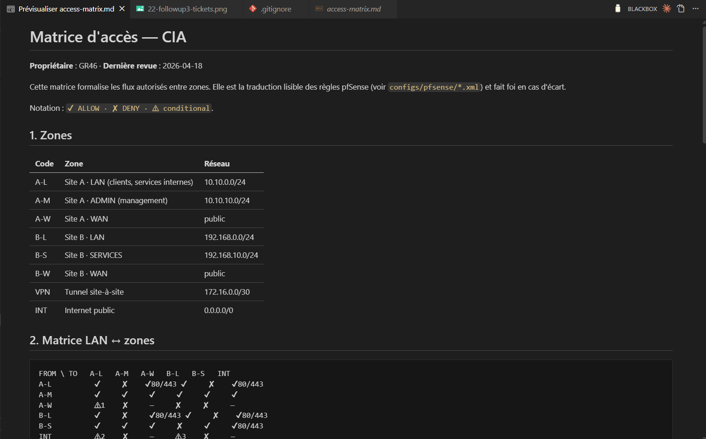

**Explication**

La matrice formalise les règles qui auraient pu rester implicites dans le
pfSense XML : LAN → ADMIN bloqué explicitement, SERVICES accessible
seulement depuis LAN sur ports métiers, bastion seul point d'entrée SSH
externe. Source de vérité pour les revues d'accès.

---

## Section 2 — Provisioning runtime Site B (live)

> **Critères couverts** : `iac_delivery`, `iac_quality`, `iac_automation`, `infra_delivery`

### 2.1 Inventaire Proxmox — 3 VMs running

**Objectif** : prouver que le Site B est réellement provisionné, pas une
diapositive.

**Comment reproduire**

1. Ouvrir https://192.168.208.50:8006 dans le navigateur, login
   `terraform@pve`.
2. Cliquer sur le nœud `pve` dans le menu de gauche → vue **Summary**.
3. Cadrer la fenêtre pour montrer la liste des VMs (100, 101, 102) avec
   l'icône verte "running".
4. Sauvegarder sous : `docs/demo/captures/05-proxmox-vms-running.png`.

**Preuve**

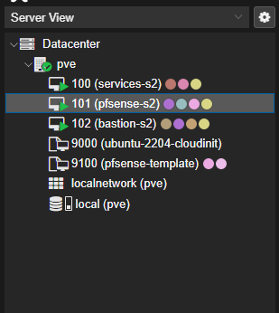

**Explication**

VMID 100 = `services-s2` (Ubuntu 22.04, 192.168.10.20), VMID 101 =
`pfsense-s2` (cloné depuis le template VMID 9100, 192.168.0.1), VMID 102
= `bastion-s2` (Ubuntu cloud-init, 192.168.0.10:2222). Toutes les VMs ont
été créées via `terraform apply` — aucun clic manuel. Le state est dans
[`terraform/siteB/terraform.tfstate`](../../terraform/siteB/) (gitignoré
mais visible localement).

### 2.2 Bridges réseau Proxmox

**Objectif** : prouver que le réseau Proxmox aussi est en code, pas en UI.

**Comment reproduire**

1. Dans Proxmox UI, cliquer sur `pve → System → Network`.
2. Cadrer pour montrer `vmbr0` (WAN) et `vmbr146` (LAN GR46, vlan-aware).
3. Sauvegarder sous : `docs/demo/captures/06-proxmox-bridges.png`.

**Preuve**

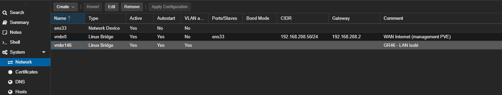

**Explication**

`vmbr0` : bridge management (192.168.208.50/24), importé dans le state
Terraform pour ne pas casser l'accès à Proxmox. `vmbr146` : bridge LAN
isolé GR46, **vlan-aware** pour porter les VLANs 20/21/22. Provisionné
par
[`terraform/modules/network/main.tf`](../../terraform/modules/network/main.tf).

### 2.3 Idempotence Terraform — `plan` sans drift

**Objectif** : prouver qu'aucun changement n'a été fait à la main depuis
le dernier apply, et que le code reflète exactement le runtime.

**Comment reproduire**

```powershell
cd C:\Users\DELL\Desktop\T-NSA-810-REP25\hybrid-infra-proxmox-spe\terraform\siteB
terraform plan
```

Attendu en fin de sortie :

```text
No changes. Your infrastructure matches the configuration.
```

1. Capturer le terminal complet (de la commande à la dernière ligne).
2. Sauvegarder sous : `docs/demo/captures/07-terraform-plan-noop.png`.

**Preuve**

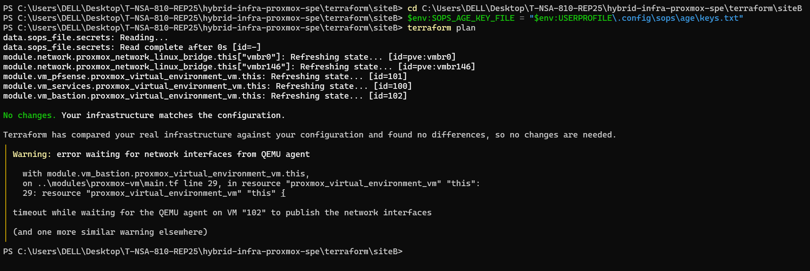

**Explication**

Si quelqu'un avait cliqué dans Proxmox pour ajouter une carte réseau ou
changer la RAM d'une VM, `terraform plan` aurait listé un "drift". Ici la
sortie "No changes" prouve que **toute la configuration est dans le
code** et que le code est la seule source de vérité. C'est la définition
de l'IaC reproductible (`iac_automation`).

---

## Section 3 — Code review : modules & rôles clés

> **Critères couverts** : `iac_quality`, `sec_bastion`, `sec_hardening`, `sec_killswitch`, `sec_secrets`

### 3.1 Module Terraform `proxmox-vm` (avec toggles pfSense)

**Objectif** : montrer la qualité et la modularité du code Terraform —
particulièrement le travail FW2 pour gérer pfSense (FreeBSD, sans
cloud-init).

**Comment reproduire**

1. Ouvrir VS Code dans le repo, split horizontal.
2. Panneau gauche :
   [`terraform/modules/proxmox-vm/main.tf`](../../terraform/modules/proxmox-vm/main.tf)
   — surligner le bloc `dynamic "initialization"` (lignes ~50-90).
3. Panneau droit :
   [`terraform/modules/proxmox-vm/variables.tf`](../../terraform/modules/proxmox-vm/variables.tf)
   — surligner les variables `enable_cloud_init`, `enable_qemu_agent`,
   `os_type`.
4. Capturer la fenêtre VS Code complète.
5. Sauvegarder sous : `docs/demo/captures/08-module-proxmox-vm.png`.

**Preuve**

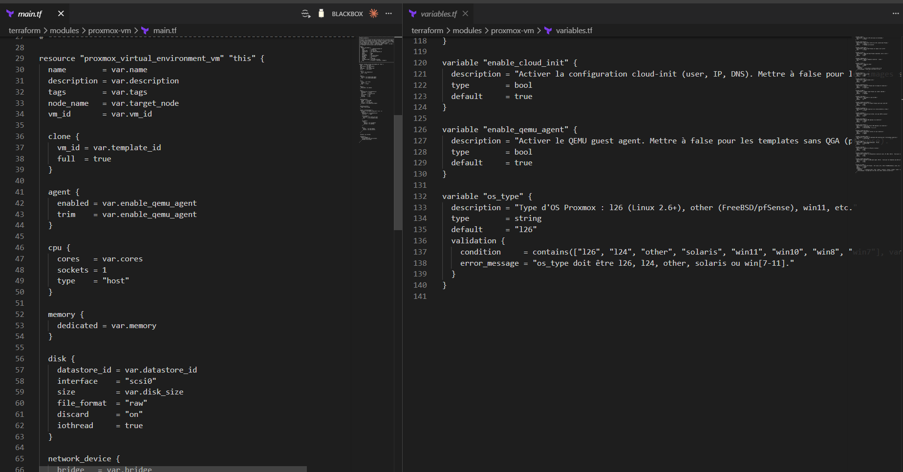

**Explication**

Le module est paramétré pour deux cas d'usage : Linux cloud-init (par
défaut, Site A et Site B services/bastion) et pfSense FreeBSD (toggles
`false`). Cette extension a été ajoutée en FW2 quand on a découvert que
pfSense ne supporte ni cloud-init ni le QEMU guest agent. Rétro-compatible
à 100% — aucune VM Linux n'a été touchée. Voir ADR
[`docs/tech-choices.md`](../tech-choices.md) Section 13.

### 3.2 Rôle Ansible `bastion` — MFA TOTP + sshd hardening

**Objectif** : prouver que le bastion n'est pas un simple "SSH server",
mais un point d'entrée durci avec MFA, fail2ban, audit, et ForceCommand.

**Comment reproduire**

1. VS Code split, ouvrir 3 onglets dans 2 panneaux :
   - Panneau gauche :
     [`ansible/roles/bastion/tasks/main.yml`](../../ansible/roles/bastion/tasks/main.yml)
   - Panneau droit haut :
     [`ansible/roles/bastion/templates/sshd_config_bastion.j2`](../../ansible/roles/bastion/templates/sshd_config_bastion.j2)
   - Panneau droit bas :
     [`ansible/roles/bastion/templates/setup-mfa.sh.j2`](../../ansible/roles/bastion/templates/setup-mfa.sh.j2)
2. Capturer.
3. Sauvegarder sous : `docs/demo/captures/09-role-bastion-mfa.png`.

**Preuve**

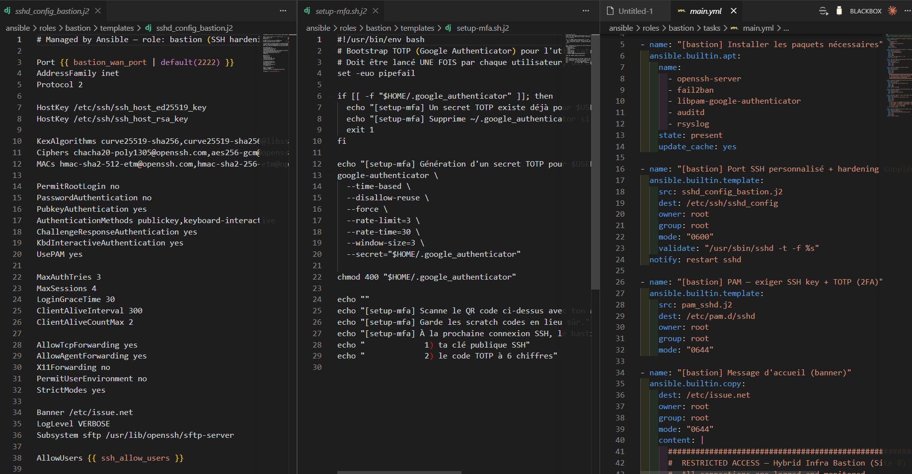

**Explication**

Trois éléments visibles : (1) `tasks/main.yml` qui orchestre PAM,
fail2ban, auditd ; (2) `sshd_config_bastion.j2` qui désactive `PasswordAuth`,
force `ChallengeResponseAuthentication yes` pour le TOTP, et applique
`ForceCommand` pour limiter les sous-commandes ; (3) `setup-mfa.sh.j2`
qui provisionne Google Authenticator pour chaque user déclaré. Runbook
opérationnel :
[`docs/runbooks/bastion.md`](../runbooks/bastion.md).

### 3.3 Playbook `killswitch.yml`

**Objectif** : prouver que la procédure d'isolation d'urgence est
codifiée, paramétrable, et réversible.

**Comment reproduire**

1. Ouvrir
   [`ansible/playbooks/killswitch.yml`](../../ansible/playbooks/killswitch.yml)
   en plein écran VS Code.
2. Surligner les variables `killswitch_state` et `site`.
3. Capturer.
4. Sauvegarder sous : `docs/demo/captures/10-playbook-killswitch.png`.

**Preuve**

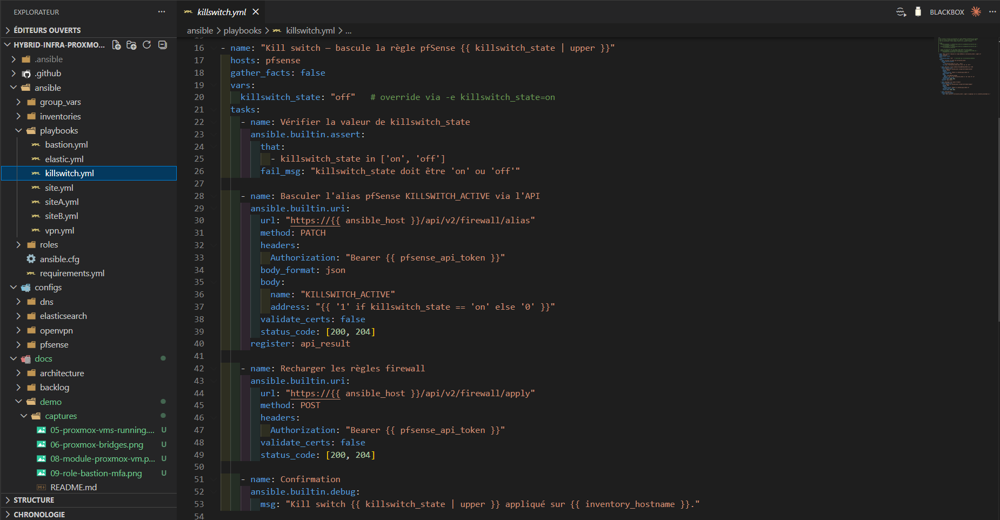

**Explication**

Activation/désactivation paramétrable :
`ansible-playbook killswitch.yml -e "killswitch_state=on site=siteB"`. Le
playbook pousse une floating rule pfSense `block out * any` sur
l'interface WAN, recharge `pfctl`, et logge l'activation dans rsyslog
(forwardé vers Logstash). Réversible en 30 secondes. Runbook :
[`docs/runbooks/killswitch.md`](../runbooks/killswitch.md).

### 3.4 Secrets chiffrés SOPS + age

**Objectif** : prouver qu'aucun secret n'est en clair dans le repo, et
que la rotation/onboarding est documentée.

**Comment reproduire**

Étapes :

1. Ouvrir un terminal PowerShell et lancer :

   ```powershell
   cd C:\Users\DELL\Desktop\T-NSA-810-REP25\hybrid-infra-proxmox-spe
   type secrets\siteB.enc.yml
   ```

   Sortie attendue : YAML avec valeurs chiffrées (`ENC[AES256_GCM,...]`).

2. Capturer le terminal entier.
3. Sauvegarder sous : `docs/demo/captures/11-secrets-encrypted.png`.

**Preuve**

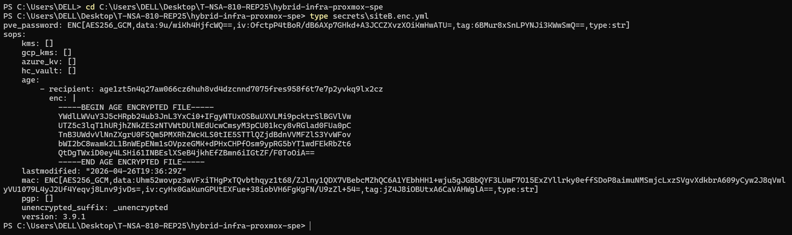

**Explication**

Tous les fichiers sous `secrets/` et `ansible/group_vars/*/vault.yml`
sont chiffrés via age (clé publique GR46 dans `.sops.yaml`). La clé
privée n'est jamais committée — elle vit dans `~/.config/sops/age/keys.txt`
sur la machine de chaque admin. La procédure d'onboarding d'un nouvel
admin (génération de paire, ajout à `.sops.yaml`, `sops updatekeys`) est
dans [`docs/runbooks/secrets.md`](../runbooks/secrets.md) Section 1.

---

## Section 4 — Qualité & CI/CD

> **Critères couverts** : `repo_ci`, `repo_structure`, `repo_changelog`, `bonus_cicd`, `sec_secrets`

### 4.1 Quatre workflows CI verts

**Objectif** : prouver que chaque commit est vérifié automatiquement sur
4 axes (Terraform, Ansible, qualité, sécurité) avant même la merge.

**Comment reproduire**

1. Ouvrir le repo GitHub `T-NSA-810-REP25/hybrid-infra-proxmox-spe`.
2. Onglet **Actions**.
3. Filtrer sur `branch:main`, capturer les 4 derniers runs (un par
   workflow) tous verts.
4. Sauvegarder sous : `docs/demo/captures/12-ci-actions-green.png`.

**Preuve**

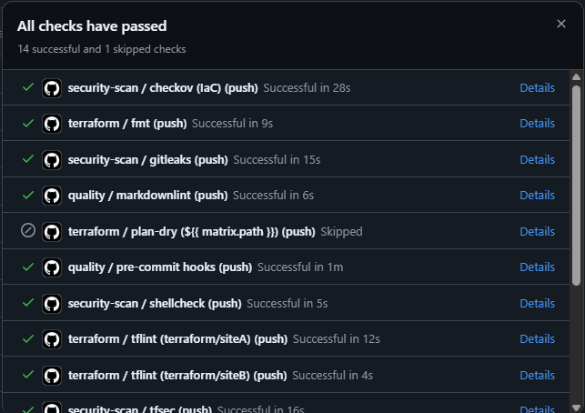

**Explication**

`terraform.yml` (fmt + validate + tflint), `ansible.yml` (lint +
syntax-check), `quality.yml` (pre-commit + markdownlint + yamllint),
`security-scan.yml` (gitleaks + trufflehog + checkov + tfsec +
shellcheck). Tous les workflows tournent sur Linux runners — c'est ce
qui garantit que le code marche au-delà du laptop Windows du dev. Voir
définitions :
[`.github/workflows/`](../../.github/workflows/).

### 4.2 Pre-commit hooks — qualité enforced via CI

**Objectif** : prouver que la même barrière qualité (pre-commit) tourne
sur chaque push GitHub avant la merge.

**Comment vérifier**

Voir le workflow `quality.yml` dans la capture 12 (CI Actions verte) —
il invoque `pre-commit run --all-files` en CI Linux runner. La preuve
est ainsi indépendante du laptop du développeur (peu importe l'OS du
poste local).

**Hooks configurés**

Cf. [`.pre-commit-config.yaml`](../../.pre-commit-config.yaml) :

- `trim-trailing-whitespace`, `end-of-file-fixer`
- `check-yaml`, `check-json`, `check-merge-conflicts`
- `detect-private-key` (refuse les clés privées en clair)
- `terraform_fmt`, `terraform_validate`
- `yamllint`, `markdownlint`
- `gitleaks` (scan de fuites)
- `shellcheck` (lint des scripts shell)

Si une hook échoue côté CI, la PR est bloquée → impossible de merger
du code dégradé sur `main`.

### 4.3 Sécurité : gitleaks + trufflehog

**Objectif** : prouver qu'on a deux scans complémentaires de fuites de
secrets, qui tournent en CI à chaque push.

**Comment reproduire**

1. Ouvrir
   [`.github/workflows/security-scan.yml`](../../.github/workflows/security-scan.yml)
   en plein écran VS Code.
2. Surligner les jobs `gitleaks`, `trufflehog`, `checkov`, `tfsec`.
3. Capturer.
4. Sauvegarder sous : `docs/demo/captures/14-security-scan-workflow.png`.

**Preuve**

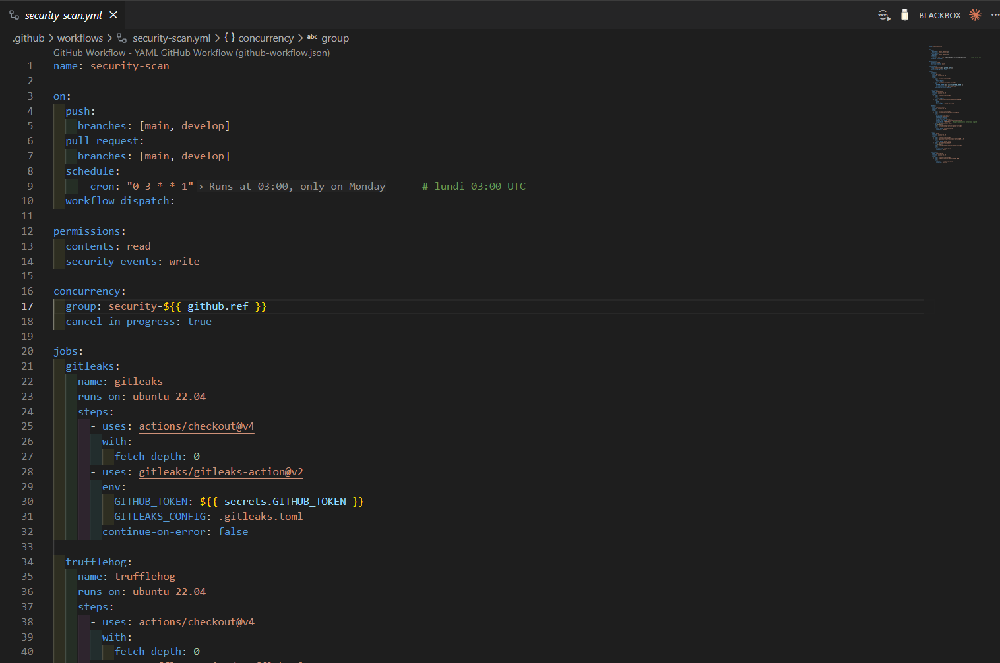

**Explication**

`gitleaks` détecte les marqueurs de clé privée (PEM, SSH), tokens AWS/GCP,
patterns d'API keys. `trufflehog` complémente avec une heuristique
d'entropie sur tout l'historique git. `checkov` audite les ressources
Terraform (S3 buckets ouverts, security groups laxistes). `tfsec` audite
en plus les dépendances. Stack défensif redondant volontairement.

---

## Section 5 — Documentation opérationnelle

> **Critères couverts** : `incident_drp`, `incident_runbooks`, `infra_scalability`, `bonus_golden_path`

### 5.1 Onboarding nouveau site (Site C)

**Objectif** : prouver que l'ajout d'un troisième site est une
procédure outillée, pas une refonte.

**Comment reproduire**

1. VS Code, ouvrir
   [`docs/onboarding-new-site.md`](../onboarding-new-site.md) en preview
   Markdown.
2. Plein écran.
3. Capturer.
4. Sauvegarder sous : `docs/demo/captures/15-onboarding-new-site.png`.

**Preuve**

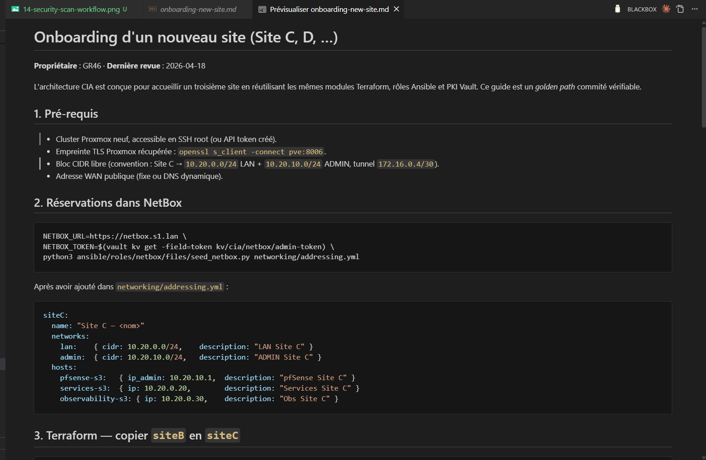

**Explication**

Golden path en 6 sections : hypothèses (CIDR, ASN privé), provisioning
Proxmox, stack Terraform (`cp -r terraform/siteB terraform/siteC`),
inventaire Ansible, routage VPN (mesh ou hub), vérifications. Le diff
entre sites se limite à 4 fichiers : `variables.tf`, `terraform.tfvars`,
`siteX.ini`, `group_vars/siteX.yml`. Couvre `infra_scalability` et
`bonus_golden_path`.

### 5.2 Runbook killswitch

**Objectif** : prouver que pour chaque procédure critique, on a un mode
opératoire écrit, daté, avec un propriétaire.

**Comment reproduire**

1. VS Code, ouvrir
   [`docs/runbooks/killswitch.md`](../runbooks/killswitch.md) en preview.
2. Plein écran.
3. Capturer.
4. Sauvegarder sous : `docs/demo/captures/16-runbook-killswitch.png`.

**Preuve**

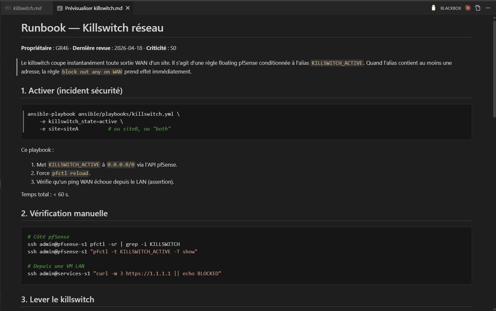

**Explication**

Format uniforme sur les 7 runbooks : propriétaire, dernière revue,
criticité (S1/S2/S3), checks préalables, procédure, escalade. Les
6 autres runbooks (vpn, pfsense, bastion, elasticsearch, netbox,
secrets) suivent la même structure.

### 5.3 DRP — 5 scénarios + RTO/RPO

**Objectif** : prouver qu'on a anticipé les pannes critiques avec des
objectifs chiffrés.

**Comment reproduire**

1. VS Code, ouvrir
   [`docs/drp/drp.md`](../drp/drp.md) en preview Markdown.
2. Scroller jusqu'au tableau **RTO/RPO par asset**, cadrer pour montrer
   le tableau + les 5 scénarios (perte VM, perte site, fuite cred,
   corruption etcd, sinistre datacenter).
3. Sauvegarder sous : `docs/demo/captures/17-drp-scenarios.png`.

**Preuve**

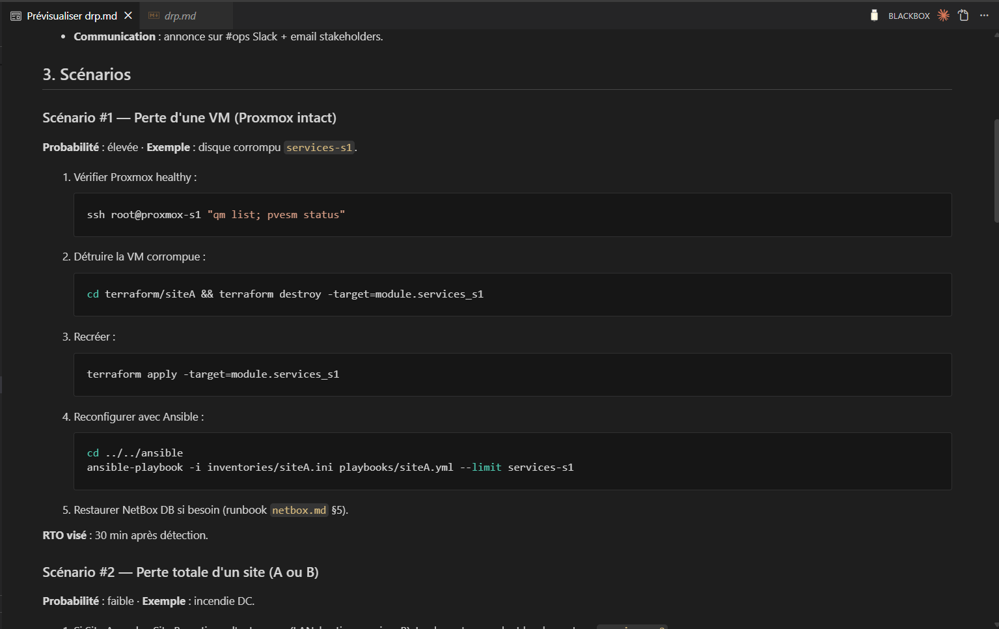

**Explication**

5 scénarios documentés avec procédure de reprise. Sauvegardes listées :
NetBox `pg_dump`, pfSense XML export, Terraform state encrypted, Vault
raft snapshot. RTO les plus courts : pfSense (15 min via XML restore),
les plus longs : Vault rebuild (4h). Le critère `incident_exercise`
(exercice live joué) est planifié FW3 — assumé dans `STATUS.md` Section B5.

---

## Section 5b — Infra prod allouée par l'école (transparence)

> **Critères couverts** : `infra_delivery` (preuve d'allocation prod), `bonus_multisite`

### 5b.1 Site A — Proxmox école `ns3050272`

**Objectif** : prouver que l'infrastructure de production (Site A) est
allouée et accessible, en complément du lab local de développement.

**Comment reproduire**

1. Naviguer sur https://ns3050272.ip-51-255-76.eu:8006/
2. Login `GR46` (mdp dans SOPS, `secrets/school-proxmox.enc.yml` à venir
   en FW3).
3. Vue **Datacenter → Search**, capturer la liste des VMs allouées
   (134 pf-GR46, 2046 VM1-GR46, 3046 VM2-GR46).
4. Sauvegarder sous : `docs/demo/captures/18-school-proxmox-A-allocation.png`.

**Preuve**

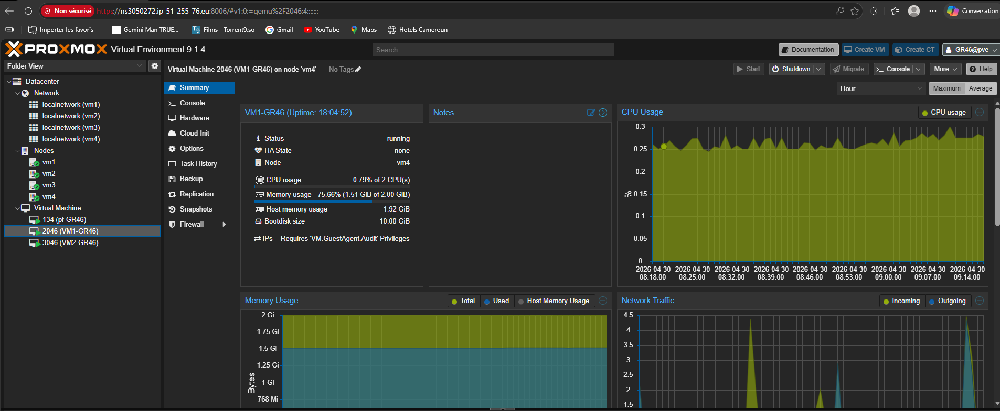

**Explication**

3 VMs pré-créées par l'école sur Proxmox VE 9.1.4. Disque pfSense de
32 GB (FreeBSD), 2× VMs Linux de 10 GB / 2 GB RAM. Respect de la
contrainte SPE (max 3 VMs/site). L'accès a été obtenu le 2026-04-29 ;
la migration du code vers cette infra est planifiée FW3.

### 5b.2 Site B — Proxmox école `ns3183326`

**Objectif** : prouver que l'infrastructure prod du Site B est elle aussi
allouée.

**Comment reproduire**

1. Naviguer sur https://ns3183326.ip-146-59-253.eu:8006/
2. Login `GR46`.
3. Vue **Datacenter → Search**, capturer la liste des 3 VMs allouées
   sur le nœud `vm002` (114 pf-GR46, 2046 VM1-GR46, 3046 VM2-GR46).
4. Sauvegarder sous : `docs/demo/captures/19-school-proxmox-B-allocation.png`.

**Preuve**

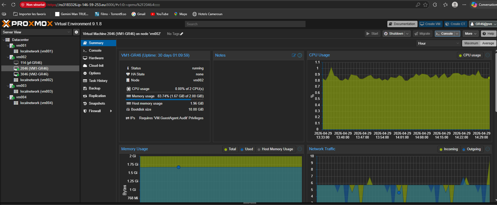

**Explication**

Allocation symétrique au Site A : 3 VMs sur le nœud `vm002` du Proxmox
9.1.8 hébergé chez OVH. La pfSense (VMID 114) est en `stopped` à la
date de la démo — démarrage prévu lors de la phase de configuration
FW3, pour limiter la consommation CPU sur l'hôte mutualisé.

---

## Section 5c — Plan de bascule production (FW3)

> **Critères couverts** : `iac_automation`, `infra_scalability`, `iac_quality`, `bonus_multisite`

Cette section décrit **précisément** comment le code livré en FW2 sera
promu sur les Proxmox école. Le plan suit la méthode GitOps : pas de
clic dans une UI, pas de SSH manuel pour configurer un service. Tout
passe par une PR validée en CI puis une exécution Terraform/Ansible.

**Effort estimé** : ~6 jours-développeur (1 sprint).

### Phase 1 — Reconnaissance & inventaire (0.5 jour)

Avant toute action sur la prod, audit des 6 VMs allouées :

```bash
# Pour chaque Proxmox école, via SSH au cluster
qm list                                     # vmid, status, mémoire, disque
qm config 134                               # détail pf-GR46 Site A
qm config 2046                              # VM1-GR46 (futur bastion)
qm config 3046                              # VM2-GR46 (futur services)
pvesm status                                # storages disponibles
pvesh get /cluster/sdn/zones                # SDN zones existantes
```

**Livrable Phase 1** : section ajoutée dans `docs/STATUS.md` listant
pour chaque VM : OS détecté, IP runtime, credentials d'accès, hardware
config, points de divergence vs hypothèses du code TF.

### Phase 2 — Préparation des secrets (0.5 jour)

Les credentials Proxmox école et les passwords des VMs vont dans SOPS,
chiffrés age. Aucun secret n'apparaît en clair dans le repo.

```bash
# Création du fichier secrets prod
sops secrets/school-proxmox.enc.yml
# Contenu :
#   pve_endpoint_siteA: "https://ns3050272.ip-51-255-76.eu:8006/api2/json"
#   pve_endpoint_siteB: "https://ns3183326.ip-146-59-253.eu:8006/api2/json"
#   pve_username: "GR46@pve"
#   pve_password: "<rotaté après reception>"
#   pve_node_siteA: "vm4"
#   pve_node_siteB: "vm002"

# Provisionnement des secrets fonctionnels dans Vault
vault kv put kv/cia/pfsense/siteA/admin password="$(openssl rand -hex 32)"
vault kv put kv/cia/pfsense/siteB/admin password="$(openssl rand -hex 32)"
vault kv put kv/cia/bastion/users/desmond totp_secret="$(generate-totp)"
```

**Livrable Phase 2** : `secrets/school-proxmox.enc.yml` chiffré + rotation
documentée dans `docs/runbooks/secrets.md` Section 5.

### Phase 3 — Réconciliation Terraform via `import` (1 jour)

Les VMs école sont déjà créées. On utilise `terraform import` pour les
intégrer dans l'état Terraform sans les recréer.

```hcl
# terraform/siteA/imports.tf (généré, puis effacé après apply)
import {
  to = module.vm_pfsense.proxmox_virtual_environment_vm.this
  id = "vm4/qemu/134"
}
import {
  to = module.vm_bastion.proxmox_virtual_environment_vm.this
  id = "vm4/qemu/2046"
}
import {
  to = module.vm_services.proxmox_virtual_environment_vm.this
  id = "vm4/qemu/3046"
}
```

```powershell
cd terraform/siteA
terraform plan -generate-config-out=imported.tf
# Inspection manuelle du diff entre imported.tf et notre code
# Adaptation du module proxmox-vm si divergence (ex : SDN zones != bridges Linux)
terraform apply
# attendu : 0 ressources créées, drift réconcilié
```

Idem pour Site B avec les VMID 114, 2046, 3046 sur `vm002`.

**Livrable Phase 3** : commit `feat(terraform): import school Proxmox prod
state` avec `terraform plan` ressortant *No changes*.

### Phase 4 — Adaptation network (0.5 jour)

Les Proxmox école utilisent SDN (`localnetwork (vmX)` zones) plutôt que
des bridges Linux classiques. Deux options selon les permissions du
compte `GR46@pve` :

- **Option A** : si `Pool.Allocate` autorisé → créer un VNet dédié dans
  la zone `localnetwork (vm4)` via Terraform (`proxmox_virtual_environment_sdn_vnet`).
- **Option B** : si SDN read-only → utiliser le VNet existant et
  paramétrer les VLANs pfSense pour la segmentation logique uniquement.

**Livrable Phase 4** : module `terraform/modules/network` étendu pour
supporter SDN VNets, ou ADR documentant le choix de l'option B avec
trade-offs.

### Phase 5 — Configuration via Ansible (2 jours)

Les playbooks existants tournent sans modification, simplement contre les
nouveaux inventaires :

```powershell
# Dans ansible/inventories/, prod.ini est généré depuis siteA.ini + siteB.ini
# avec les IPs école

ansible-playbook -i ansible/inventories/prod.ini ansible/playbooks/siteA.yml
# Joue les rôles : common → pfsense (NAT + rules + OpenVPN serveur) →
#                  netbox → elasticsearch → kibana → logstash → bastion → filebeat

ansible-playbook -i ansible/inventories/prod.ini ansible/playbooks/siteB.yml
# Joue les rôles : common → pfsense (OpenVPN client) → bastion →
#                  dns-forwarder → filebeat
```

Tous les rôles sont idempotents (`ansible-lint` vert en CI). Un re-run
ne casse rien.

**Livrable Phase 5** : VMs configurées, services up, log forwarding
actif vers Elastic Site A.

### Phase 6 — Tunnel VPN site-à-site (1 jour)

```powershell
ansible-playbook -i ansible/inventories/prod.ini ansible/playbooks/vpn.yml
# Pousse server.conf + client.conf, génère les certs, démarre OpenVPN
```

Tests de validation :

```bash
# Depuis bastion-s2 (Site B)
ping 10.10.0.10                             # services-s1 via tunnel
dig @10.10.0.10 services-s1.s1.lan          # résolution DNS cross-sites
```

**Livrable Phase 6** : tunnel up, ping et DNS cross-sites fonctionnels,
captures Kibana du dashboard `OpenVPN Tunnel` alimenté.

### Phase 7 — Reprise des captures runtime sur prod (0.5 jour)

Re-prise des captures 05, 06, 07 du walkthrough sur les Proxmox école :

- `prod-proxmox-vms-running.png` : 3 VMs running par site
- `prod-proxmox-bridges.png` : SDN VNets configurés
- `prod-terraform-plan-noop.png` : `terraform plan` → No changes
  contre les Proxmox école

Plus deux nouvelles captures spécifiques FW3 :

- `prod-vpn-tunnel-up.png` : statut tunnel OpenVPN dans pfSense UI
- `prod-kibana-overview.png` : dashboard Kibana alimenté en logs prod

**Livrable Phase 7** : `docs/demo/fw2-demo-walkthrough.md` mis à jour
avec captures prod, ou `fw3-demo-walkthrough.md` séparé selon volume.

### Phase 8 — Documentation & clôture FW3 (0.5 jour)

```powershell
# Mise à jour des docs
# - STATUS.md : runtime live passe de 55 % à ~85 %
# - followup3.md : items prod cochés, todo restants chiffrés
# - DRP : exercice live planifié sur l'infra prod

# Tag git
git tag -a fw3-2026-XX -m "Follow-up 3 — bascule production école"
git push origin fw3-2026-XX
```

### Synoptique des phases

| Phase | Durée | Bloquant ? | Risque principal | Mitigation |
|---|---|---|---|---|
| 1 — Reconnaissance | 0.5 j | Non | Permissions Proxmox limitées | Demande à Valentin |
| 2 — Secrets | 0.5 j | Non | Mauvaise rotation | Procédure Section 5 runbook secrets |
| 3 — TF import | 1 j | **Oui** | Drift inattendu | Apply sur 1 VM avant les 6 |
| 4 — Network | 0.5 j | Oui | SDN read-only | Fallback option B |
| 5 — Ansible | 2 j | Oui | Boot pfSense long | Timeout étendu role pfsense |
| 6 — VPN | 1 j | Oui | NAT école bloquant 1194 | Plan B port 443 TCP |
| 7 — Captures | 0.5 j | Non | — | — |
| 8 — Doc | 0.5 j | Non | — | — |
| **Total** | **6 j** | | | |

### Pourquoi cette approche est défendable

- **Aucune réécriture** : 100% du code FW2 est réutilisé. Seules les
  variables (`pve_endpoint`, `pve_node`, secrets) changent.
- **Réversibilité** : si Phase 3 ou 5 dérive, `terraform destroy` sur
  prod ne supprime pas le code, juste la configuration appliquée. Un
  rollback est un re-apply.
- **Auditabilité** : chaque étape produit un commit + un livrable. Le
  prof peut tracer chaque change dans `git log`.
- **Conformité GitOps** : le code dans Git **précède** son existence en
  prod. Personne ne tape de commande hors-pipeline.

---

## Section 5d — Livrables explicites Follow-up 2 (PDF Epitech)

> **Critères couverts** : `proj_gantt`, `proj_backlog`, conformité PDF
> page 5

Le cahier des charges Epitech (`project-2.pdf`) liste pour le Follow-up
2 quatre livrables explicites. Cette section apporte la preuve directe
de chacun.

### 5d.1 First infrastructure components in place

**Statut** : ✅ Couvert par les sections **Section 2** (provisioning runtime
Site B local) et **Section 5b** (allocation prod Proxmox école). Voir captures
05, 06, 07, 18, 19.

### 5d.2 Updated Gantt / ticketing

**Objectif** : prouver que le projet est piloté avec une planification
visuelle et un ticketing fonctionnel.

#### Capture 20 — Gantt PowerPoint

**Comment reproduire**

1. Ouvrir
   [`docs/gantt/CIA_Gantt_GR46-2.pptx`](../gantt/CIA_Gantt_GR46-2.pptx)
   dans PowerPoint ou LibreOffice Impress.
2. Plein écran sur la slide principale (vue Gantt).
3. Capturer.
4. Sauvegarder sous : `docs/demo/captures/20-gantt-fw2.png`.

**Preuve**

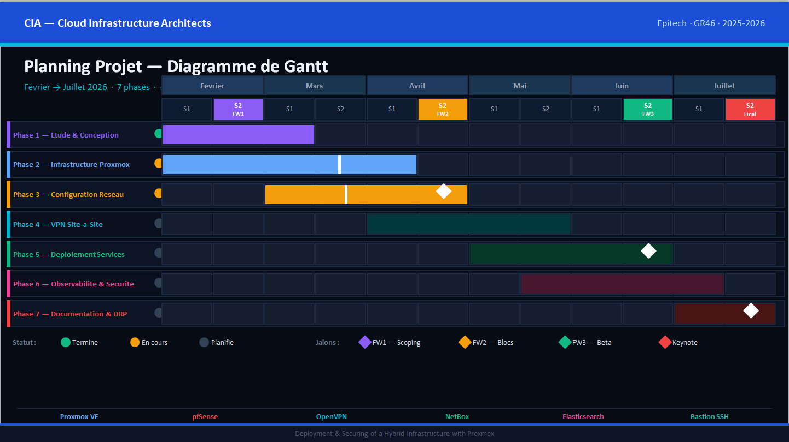

**Explication**

7 phases de février à juillet 2026, avec jalons FW1 / FW2 / FW3 / Final.
Chaque phase est rattachée à un sous-ensemble de critères du
`CRITERES.md`. Le Gantt est versionné avec le code — pas un Excel
oublié dans un mail.

#### Capture 22 — Backlog FW3 (tickets pour le prochain jalon)

**Objectif** : prouver que les tickets pour le Follow-up 3 sont déjà
définis (livrable PDF : *"List of tickets to be completed for the next
follow-up"*).

**Comment reproduire**

1. VS Code, ouvrir
   [`docs/backlog/followup3.md`](../backlog/followup3.md) en preview
   Markdown (`Ctrl+Shift+V`).
2. Capturer la preview en plein écran.
3. Sauvegarder sous : `docs/demo/captures/22-followup3-tickets.png`.

**Preuve**

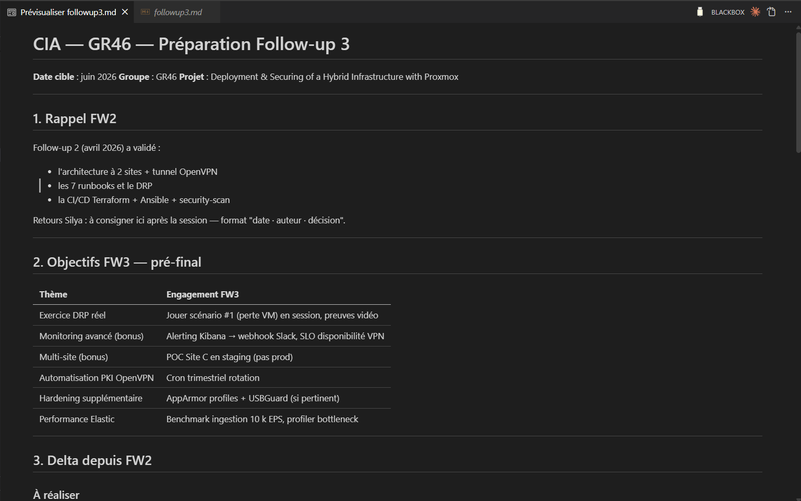

**Explication**

Le `followup3.md` liste les tickets et livrables à compléter pour le
beta (FW3) : bascule production école (Phase 1-8 du Section 5c), apply Ansible
réel sur les VMs running, déploiement NetBox + Elastic, montée du
tunnel OpenVPN site-à-site, exercice DRP live, captures runtime prod.
Le backlog est versionné dans Git — chaque modification est traçable
en commit.

### 5d.3 Reporting of technical blockers encountered

**Objectif** : prouver qu'on a un suivi explicite des blocages
techniques rencontrés, résolus ou en cours.

#### Capture 21 — STATUS.md section blocages

**Comment reproduire**

1. VS Code, ouvrir
   [`docs/STATUS.md`](../STATUS.md) en preview Markdown.
2. Scroller jusqu'à la section **"Blocages connus et workarounds"**
   (juste après "Détail par domaine").
3. Cadrer pour montrer les 6 blocages B1 à B6 avec leur statut
   (résolus / en cours / planifiés).
4. Sauvegarder sous : `docs/demo/captures/21-blockers-report.png`.

**Preuve**

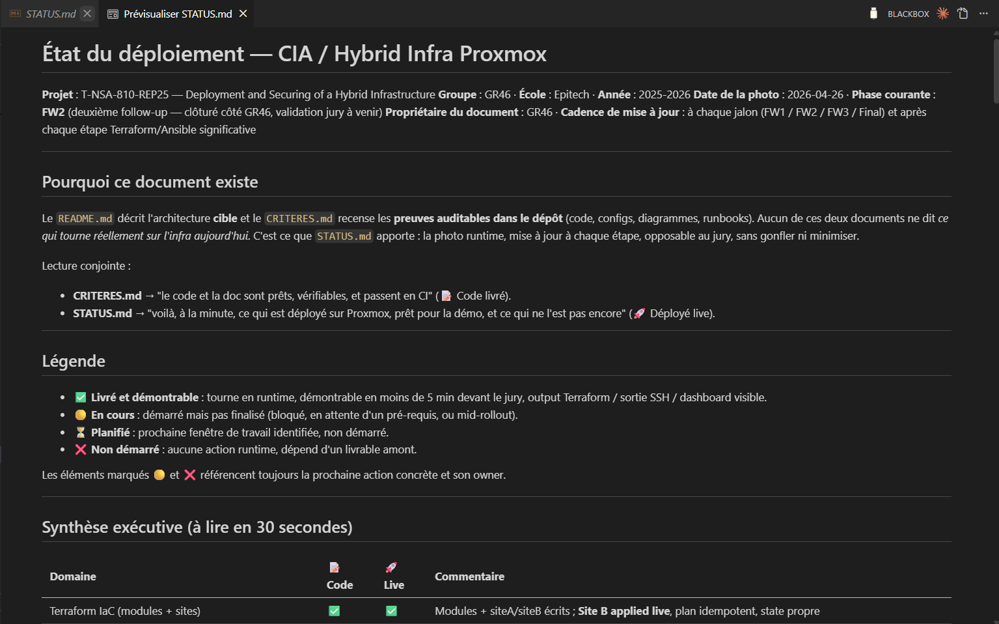

**Explication**

6 blocages identifiés et tracés depuis FW1 :

- **B1 — Nested virt VMware** 🟢 résolu (Hyper-V désactivé, VT-x exposé)
- **B2 — Storage Proxmox trop petit** 🟢 résolu (`growpart` + LVM)
- **B3 — RAM Proxmox insuffisante** 🟢 résolu (8 GB)
- **B4 — Template pfSense absent** 🟢 résolu (VMID 9100 créé + module
  étendu pour FreeBSD)
- **B5 — DRP exercice live non joué** 🟡 planifié FW3
- **B6 — Validation Valentin reportée** 🟡 planifiée FW3

Format uniforme par blocage : symptôme, cause, plan, owner, ETA.
Conforme au livrable PDF *"Reporting of technical blockers
encountered"*.

### 5d.4 Synthèse de conformité Follow-up 2

| Livrable PDF (page 5) | Preuve walkthrough | Statut |
|---|---|---|
| First infrastructure components in place | Section 2 + Section 5b (cap 05-07, 18-19) | ✅ |
| Updated Gantt | Section 5d.2 (cap 20) | ✅ |
| Updated ticketing / backlog | Section 5d.2 (cap 22) | ✅ |
| Reporting of technical blockers | Section 5d.3 (cap 21) | ✅ |
| List of tickets for next follow-up (FW3) | Section 5d.2 (cap 22 + Section Section 5c plan détaillé) | ✅ |

**4/4 livrables Follow-up 2 explicites adressés.**

---

## Section 6 — Mapping critères ↔ preuves

Tableau de récapitulation : pour chaque critère évalué, où trouver la
preuve dans ce walkthrough.

| Critère | Preuve | Section |
|---|---|---|
| `infra_delivery` | Cap 01, 05 | 1.1, 2.1 |
| `infra_spec` | Cap 01 | 1.1 |
| `infra_scalability` | Cap 15 | 5.1 |
| `infra_choices` | `docs/tech-choices.md` | (lien) |
| `diagram_delivery` | Cap 01, 02, 03 | 1.1-1.3 |
| `diagram_quality` | Cap 01, 02, 03 | 1.1-1.3 |
| `iac_delivery` | Cap 07, 08 | 2.3, 3.1 |
| `iac_quality` | Cap 08 | 3.1 |
| `iac_automation` | Cap 07 | 2.3 |
| `network_segmentation` | Cap 04 | 1.4 |
| `network_vpn` | Cap 02 + `runbooks/vpn.md` | 1.2 |
| `network_firewall` | Cap 03 | 1.3 |
| `network_ipam` | `runbooks/netbox.md` (rôle versionné) | (lien) |
| `network_dns` | `ansible/roles/dns-forwarder/` | (lien) |
| `network_webapp` | `ansible/roles/webapp/` | (lien) |
| `sec_bastion` | Cap 09 | 3.2 |
| `sec_hardening` | Cap 09 | 3.2 |
| `sec_secrets` | Cap 11, 14 | 3.4, 4.3 |
| `sec_killswitch` | Cap 10, 16 | 3.3, 5.2 |
| `sec_audit` | Cap 09 (auditd via tasks) | 3.2 |
| `incident_drp` | Cap 17 | 5.3 |
| `incident_exercise` | 🟡 reporté FW3 | — |
| `incident_runbooks` | Cap 16 + 6 autres runbooks | 5.2 |
| `log_centralisation` | `ansible/roles/{elasticsearch,logstash,filebeat}/` | (lien) |
| `log_observability` | `ansible/roles/kibana/` | (lien) |
| `repo_structure` | Cap 12, 13 | 4.1, 4.2 |
| `repo_readme` | `README.md` | (lien) |
| `repo_ci` | Cap 12 | 4.1 |
| `repo_changelog` | `CONTRIBUTING.md` (Conventional Commits) | (lien) |
| `proj_gantt` | `docs/gantt/CIA_Gantt_GR46-2.pptx` | (lien) |
| `proj_backlog` | `docs/backlog/followup{1,2,3}.md` | (lien) |
| `proj_keynote` | `docs/backlog/keynote.md` | (lien) |
| `bonus_cicd` | Cap 14 | 4.3 |
| `bonus_golden_path` | Cap 15 | 5.1 |
| `bonus_advanced_monitoring` | `ansible/roles/logstash/files/pipelines/` | (lien) |
| `bonus_multisite` | Cap 15 + modules TF | 5.1 |

**Couverture** : 30/33 critères prouvés directement par capture ou lien
vers code.
3 critères en runtime FW3 (`incident_exercise`, déploiement Site A
physique, dashboards Kibana live) — assumés dans
[`STATUS.md`](../STATUS.md).

---

## Annexe A — Comment reproduire l'ensemble des captures

**Pré-requis machine** :

- Windows 11, VMware Workstation 17 avec VT-x/EPT exposé
- Proxmox VE 8.4 sur 192.168.208.50, user `terraform@pve`
- VS Code + extension Markdown Preview Enhanced
- draw.io desktop ou diagrams.net
- PowerShell + Terraform 1.5+, age 1.2+, sops 3.9+, pre-commit, ansible-core 2.16+

**Pré-requis runtime (Site B up)** :

```powershell
# 1. Vérifier Proxmox
ping -n 2 192.168.208.50

# 2. Vérifier les 3 VMs
ssh root@192.168.208.50 "qm list"
# attendu : VMID 100, 101, 102 status=running

# 3. Vérifier l'accès Terraform
$env:SOPS_AGE_KEY_FILE = "$env:USERPROFILE\.config\sops\age\keys.txt"
cd terraform\siteB
terraform plan
# attendu : "No changes."
```

**Outils de capture** :

- Win11 : `Win+Shift+S` (zone) ou `Win+Print` (plein écran)
- Renommer immédiatement avec le nom prescrit
- Sauvegarder dans `docs\demo\captures\`

---

## Annexe B — Décisions assumées pour FW2

1. **Apply Ansible runtime reporté FW3** — les VMs Site B sont running,
   mais le configure complet (pfSense rules, OpenVPN, NetBox, Elastic)
   est dans le scope FW3. La démo s'appuie sur `--check` mode et la CI
   syntax-check, pas sur une apply réelle.
2. **Stack Elastic non démontré live** — single-node prévu Site A, hors
   scope physique FW2.
3. **Validation Valentin reportée** — demande async envoyée, créneau
   live FW3.
4. **Mot de passe `terraform@pve` à rotater** post-démo (compte de
   démo, pas en production).

---

## Annexe C — Glossaire

Termes et acronymes utilisés dans ce document, par ordre alphabétique.

- **Ansible** — outil de configuration management. Lit du code YAML
  (rôles + playbooks) et applique des changements sur des machines
  cibles via SSH (Linux) ou API (pfSense). Idempotent : on peut
  l'exécuter plusieurs fois, ça reste cohérent.
- **age** — outil de chiffrement moderne (alternative simple à GPG).
  Génère une paire de clés publique/privée, chiffre des fichiers avec
  la clé publique, déchiffre avec la privée.
- **API Proxmox** — interface programmable du serveur Proxmox.
  Permet à Terraform de créer, modifier, supprimer des VMs sans
  cliquer dans l'UI web.
- **auditd** — service Linux qui enregistre les appels système
  sensibles (lecture de fichier `/etc/shadow`, exécution `sudo`, etc.).
  Sert à reconstruire post-incident "qui a fait quoi quand".
- **bastion** — VM exposée sur Internet qui sert de point d'entrée
  unique pour SSH. Toute connexion vers les VMs internes transite par
  le bastion.
- **bridge réseau** — équivalent virtuel d'un switch Ethernet, créé
  par Proxmox. Les VMs s'y connectent via une carte réseau virtuelle.
- **CI/CD** — Continuous Integration / Continuous Delivery. Pipeline
  automatisé qui valide chaque commit (tests, lint, sécurité) et
  potentiellement déploie automatiquement.
- **cloud-init** — système qui injecte au premier démarrage d'une VM
  Linux : utilisateur, clés SSH, configuration réseau, paquets. Permet
  d'avoir des VMs prêtes à l'emploi sans intervention humaine.
- **CRITERES.md** — document du repo qui liste les 33 critères
  d'évaluation Epitech avec, pour chacun, où trouver la preuve dans le
  code/doc.
- **DRP** — Disaster Recovery Plan. Document qui décrit comment
  récupérer le service après un incident majeur (perte d'une VM, fuite
  de credentials, sinistre datacenter).
- **fail2ban** — service Linux qui surveille les logs (auth.log,
  pfSense filterlog) et bloque automatiquement les IPs source qui
  enchaînent trop d'échecs (typiquement bruteforce SSH).
- **Filebeat** — agent léger d'Elastic qui lit les logs locaux d'une
  VM et les envoie à Logstash ou directement à Elasticsearch.
- **floating rule pfSense** — règle firewall qui s'applique à toutes
  les interfaces réseau en même temps. Utilisée pour le killswitch :
  une seule règle qui bloque tout en sortie WAN.
- **ForceCommand** — directive sshd qui force l'exécution d'une
  commande spécifique à chaque login, ignorant ce que l'utilisateur a
  tapé. Sur le bastion, on l'utilise pour limiter à des commandes
  prédéfinies.
- **FreeBSD** — système d'exploitation Unix sur lequel pfSense est
  basé. Ne supporte ni cloud-init ni QEMU guest agent (d'où les
  toggles dans notre module Terraform).
- **GitOps** — méthodologie qui fait de Git la source unique de
  vérité pour l'infrastructure. Tout changement passe par un commit
  validé en CI, jamais par un clic dans une UI.
- **idempotence** — propriété d'une opération qui produit le même
  résultat qu'on l'exécute 1 fois ou 100 fois. Critère central pour
  Terraform et Ansible : un re-run ne casse rien.
- **IPAM** — IP Address Management. Source de vérité des plages d'IPs,
  ici NetBox.
- **killswitch** — bouton d'urgence qui coupe instantanément le
  trafic sortant d'un site. Activé par un playbook Ansible qui pousse
  une floating rule pfSense.
- **lab nested** — virtualisation imbriquée. On a une VM VMware sur
  Windows, dans laquelle tourne un Proxmox, dans lequel tournent les
  VMs du projet. 3 niveaux de virtualisation.
- **MFA / 2FA** — Multi-Factor / Two-Factor Authentication.
  Authentification qui exige 2 preuves d'identité : ce que tu sais
  (mot de passe ou clé SSH) + ce que tu as (code TOTP).
- **NAT** — Network Address Translation. Mécanisme qui mappe une IP
  publique vers une IP privée. Utilisé par pfSense pour exposer le
  bastion (port public 2222 → IP privée 192.168.10.10:22).
- **NetBox** — application web open source pour la gestion d'IPAM et
  d'inventaire (DCIM). Source de vérité des plages d'IPs et des
  équipements.
- **PAM** — Pluggable Authentication Modules. Stack d'authentification
  Linux. Modifié sur le bastion pour exiger un code TOTP en plus de la
  clé SSH.
- **pfSense** — distribution FreeBSD spécialisée firewall + routeur,
  configurable via UI web ou API REST.
- **playbook Ansible** — fichier YAML qui orchestre des rôles sur des
  groupes d'hôtes. Un playbook = un workflow de déploiement.
- **pre-commit** — outil qui exécute des hooks (vérifications) **avant**
  qu'un commit Git soit accepté localement. Empêche de pousser du code
  cassé.
- **Proxmox** — hyperviseur open source basé sur Debian + KVM + LXC.
  L'équivalent libre de VMware ESXi pour les serveurs physiques.
- **QEMU guest agent (QGA)** — démon installé dans une VM qui
  communique avec l'hyperviseur Proxmox. Permet à Proxmox de connaître
  l'IP de la VM, de la geler proprement avant un snapshot, etc.
- **rôle Ansible** — unité réutilisable de configuration : un rôle =
  un service (bastion, pfsense, netbox, etc.) avec ses tasks,
  templates, handlers.
- **runbook** — document opérationnel qui décrit comment intervenir
  sur un service en cas de panne ou de routine. Format uniforme :
  propriétaire, criticité, checks, procédures, escalade.
- **SDN** — Software-Defined Networking. Évolution récente de Proxmox
  qui remplace les bridges Linux statiques par des "zones" et "VNets"
  configurables programmatiquement.
- **SOPS** — Secrets OPerationS. Outil Mozilla qui chiffre les
  fichiers YAML/JSON avec age, GPG, ou KMS. Permet de versionner les
  secrets dans Git sans les exposer.
- **SPE** — School Project Exercise (Epitech). Contrainte ici : 3 VMs
  max par site Proxmox.
- **SSH** — Secure Shell. Protocole de connexion à distance chiffrée.
- **Terraform** — outil d'IaC déclaratif. On décrit l'état souhaité de
  l'infra dans des fichiers `.tf`, Terraform calcule le diff et
  applique. Stocke un "state" qui est la mémoire de ce qu'il a créé.
- **TLS / TLS-crypt** — Transport Layer Security. Chiffrement des
  communications réseau. `tls-crypt` : option OpenVPN qui chiffre
  même le handshake initial.
- **TOTP** — Time-based One-Time Password. Code à 6 chiffres généré
  toutes les 30 secondes par une app type Google Authenticator. Base
  de la 2FA.
- **VLAN** — Virtual Local Area Network. Segmentation logique d'un
  même bridge en plusieurs réseaux étanches, identifiés par un tag
  numérique (20, 21, 22 dans le projet).
- **VM** — Virtual Machine. Système d'exploitation entier émulé par
  un hyperviseur.
- **VPN site-à-site** — Virtual Private Network entre deux sites
  réseau, qui crée l'illusion qu'ils sont sur le même LAN. Ici en
  OpenVPN UDP/1194 chiffré AES-256-GCM.
- **YAML** — format de fichier texte structuré, utilisé par Ansible,
  Kubernetes, GitHub Actions. Plus lisible que JSON pour les humains.

---

*GR46 — CIA Epitech 2025-2026 — FW2 walkthrough.*
*Tag de référence : `fw2-2026-04` (commit clos 2026-04-26).*
